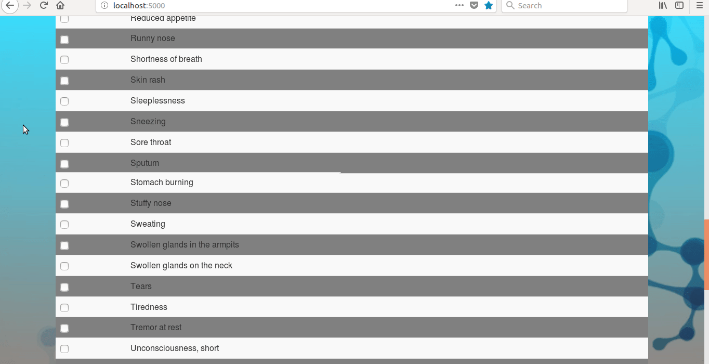

# MEDICIVE
Web app for medical dignosis and treatment suggestion based on symptoms entered by user

### Project Structure
|──────MEDICIVE/  
| |────run.py  
| |────app/    
| | |────api/  
| | | |────api1.py   
| | | |────api2.py   
| | | |────api3.py   
| | | |────api4.py   
| | | |────api5.py   
| | | |────api_test.py   
| | | |────client.py   
| | | |────config.py   
| | | |────config_med.py   
| | | |────__init__.py   
| | | |────models.py   
| |────templates/  
| | | |────symptom.html  
| | | |────diagnosis.html  
| | | |────tretement.html  
| | | |────search.html  
| | | |────select.html  
| | | |────diagnosis_bot.html  
| | | |────location.html      
| | | |────map.html   
| | | |────404.html     
| | ────__init__.py  
| |────static/    
| | |────mobile.jpg        
| |────medicive.db  
| |────web_scrapped.csv  

- 'app' folder has file for flask database configuration and controllers for all API (5 APIs given in question).
- 'api' folder contains 5 APIs(api1.py, api2.py, api3.py, api4.py, api5.py) and a unit test file for testing APIs(api_test.py).
- 'templates' folder contains html file for view.
- 'static' folder contains static file(image).
- 'config.py' contains config file for Apimedic API. User need to replace the API key with the key they get from [here].(https://apimedic.com/)
- 'config_med.py' contains config file for Infermedica API. User need to replace API key with the key they get from [here].(https://developer.infermedica.com/)
- 'medicive.db' is sqlite3 database.
- 'web_scraped.csv' contains web scarpped contents. It will be created at the time of web scrapping.

### Getting Started

#### How to run this project on your local machine 
1) Download zip or clone it using 'git clone https://github.com/kumarijyotsna/MEDICIVE.git'
2) Unzip the downloaded zip file
3) Run command 'pip install requirements.txt' to install all the required dependencies
4) Run the project by command 'python run.py' frpm MEDICIVE folder.

#### Prerequisites
1) Python2.7 or Python3.5
2) Flask
3) sqlite3
4) jinja2 template

### Built with
This project has been built using 
1) Language Used: Python2.7
2) Backend : Flask
3) Database: sqlite3
4) Frontend: HTML, CSS, Bootstrap, jinja2
5) Dependency management: pip
6) API Used: Apimedic, Infermedica

